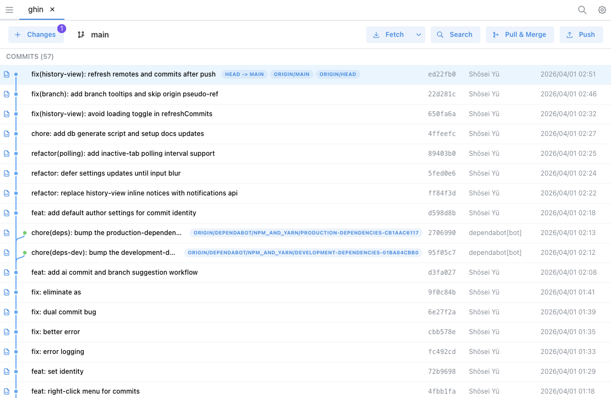
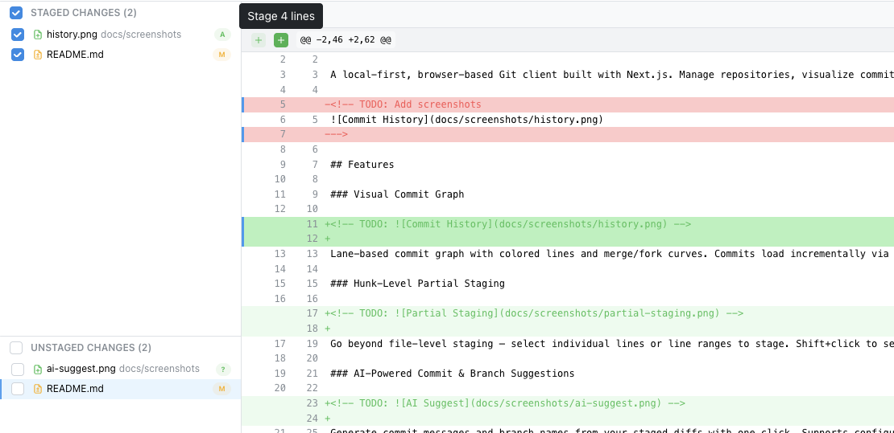
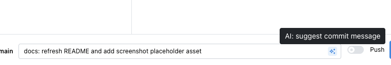

# ghin

A local-first, browser-based Git client built with Next.js. Manage repositories, visualize commit history, stage changes at the line level, and leverage AI — all from your browser.



## Features

### Visual Commit Graph

<!-- TODO:  -->

Lane-based commit graph with colored lines and merge/fork curves. Commits load incrementally via infinite scroll with virtualized rendering for smooth performance. A floating button lets you jump back to HEAD instantly.

### Hunk-Level Partial Staging



Go beyond file-level staging — select individual lines or line ranges to stage. Shift+click to select a range. The diff viewer highlights additions and deletions so you can review exactly what goes into each commit.

### AI-Powered Commit & Branch Suggestions



Generate commit messages and branch names from your staged diffs with one click. Supports configurable providers and models (OpenAI Codex and more).

### Multi-Repo Workspace

<!-- TODO:  -->

Open multiple repositories as tabs and switch between them instantly. Each tab shows real-time status badges — ahead/behind counts, change counts, and conflict indicators. Tabs persist across sessions.

### Rich Keyboard Shortcuts

<!-- TODO:  -->

Vim-style `j`/`k` navigation in file lists, `⌘+K` to search, `⌘+Enter` to commit, `⌘+Shift+P` to push, `⌘+B` to switch branches, and more. Press `/` to see all available shortcuts.

### Smart Polling & Background Sync

<!-- TODO:  -->

Auto-fetch on a configurable set of remotes. Adaptive polling adjusts the refresh interval — fast when the tab is active, slower when it's in the background — so you stay up-to-date without wasting resources.

### Powerful Search

<!-- TODO:  -->

Search commits by message, file path (with glob support), or SHA. Results appear instantly in a `⌘+K` dialog.

### Branch Management

<!-- TODO:  -->

A drawer UI with local and remote tabs lets you filter, search, and switch branches. Create a new branch from any commit, checkout in detached HEAD mode, or reset (hard/mixed/soft) via a right-click context menu.

### Changes View

<!-- TODO:  -->

Two-pane layout with a file list on the left and a diff viewer on the right. Files are color-coded by status (added, modified, deleted, renamed, copied, unmerged). Stage or unstage all files at once, commit to a new branch, auto-push after commit, and adjust the diff font size to your preference.

## Setup

```bash
pnpm install --frozen-lockfile
pnpm db:migrate
pnpm db:generate
pnpm dev:frontend
```

Open [http://localhost:3000](http://localhost:3000).

Data is stored in `~/.ghin/database.sqlite3`.

## Commands

```bash
pnpm dev:frontend    # Dev server
pnpm build           # Build all packages
pnpm checks          # Lint, typecheck, format check, test
pnpm db:migrate      # Run database migrations
pnpm db:generate     # Generate Prisma client
pnpm db:studio       # Prisma Studio
```

## Tech Stack

- **Framework**: Next.js 16 / React 19
- **UI**: Mantine 8
- **DB**: SQLite via Prisma (`~/.ghin/`)
- **Monorepo**: pnpm + Turborepo

## Security

### Dependency Version Pinning

All dependencies are pinned to exact versions (no `^` or `~` prefix) to prevent unintended version changes during `pnpm install`. The `.npmrc` file sets `save-exact=true`, so newly added dependencies are automatically pinned.

### Dependabot

GitHub Dependabot automates:

- **Security updates** — PRs are created automatically when vulnerabilities are detected
- **Version updates** — weekly PRs to keep dependencies up-to-date

Config: [`.github/dependabot.yml`](.github/dependabot.yml)

## License

[MIT](LICENSE)
